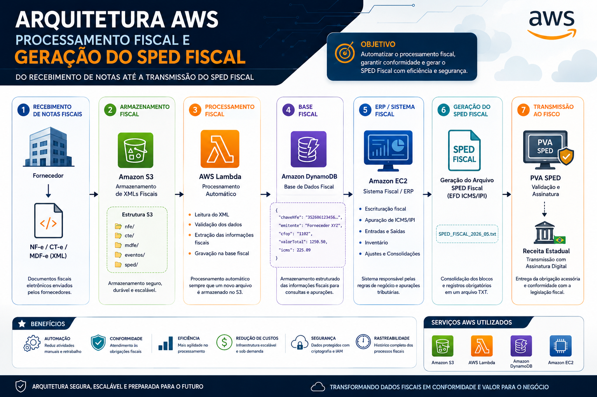

# 📊 Arquitetura AWS para Processamento Fiscal e Geração do SPED


## 📋 Sobre o Projeto

Este projeto apresenta uma arquitetura moderna baseada em serviços especialistas da **Amazon Web Services (AWS)** para automatizar o pipeline de engenharia de dados fiscais. A solução engloba desde a ingestão distribuída de documentos eletrônicos (XMLs) até o processamento, transformação estruturada e consolidação para a geração e transmissão do **SPED Fiscal (EFD)**.

O objetivo principal é mitigar erros operacionais, garantir conformidade com a legislação tributária brasileira e criar um ambiente auditável, escalável e de alta disponibilidade.

---

## 🎯 Objetivos Estratégicos

* **Automação de Ingestão:** Recebimento automatizado de DF-es diretamente de fornecedores e transportadoras.
* **Padronização e Governança:** Centralização de XMLs em um Data Lake fiscal seguro.
* **Processamento Event-Driven:** Extração de metadados tributários em tempo real utilizando computação *serverless*.
* **Compliance Fiscal:** Redução de riscos de autuação por meio de validações estruturais e cruzamento de dados pré-geração do SPED.

---

## 🏗️ Arquitetura da Solução

O diagrama abaixo detalha a topologia dos serviços na nuvem e o fluxo que o dado percorre através das camadas de armazenamento, computação e entrega de obrigações acessórias:



### ☁️ Serviços AWS Utilizados & Papéis Operacionais

| Serviço | Camada de Arquitetura | Função Principal |
| :--- | :--- | :--- |
| **Amazon S3** | Storage / Data Lake | Armazenamento durável de XMLs brutos e arquivos consolidados. |
| **AWS Lambda** | Compute / Serverless | Processamento orientado a eventos, validação e parsing dos XMLs. |
| **Amazon DynamoDB** | Database / NoSQL | Armazenamento de alta performance e baixa latência dos metadados fiscais. |
| **Amazon EC2** | Compute / Hosting | Instância escalável para processamento legados do ERP e Sistema Fiscal. |

---

## 🔄 Fluxo de Dados End-to-End

### 1. Ingestão e Armazenamento (S3)
Os documentos eletrônicos (**NF-e, CT-e, MDF-e** e Eventos Fiscais) são enviados por fornecedores ou sistemas legados diretamente para o **Amazon S3**. 

* **Estrutura de Diretórios no Buckets (`s3://fiscal/`):**
```text
  ├── nfe/       # Notas Fiscais Eletrônicas (Mercadorias)
  ├── cte/       # Conhecimentos de Transporte Eletrônicos
  ├── mdfe/      # Manifestos de Documentos Fiscais
  ├── eventos/   # Cartas de correção, cancelamentos, manifestações
  └── sped/      # Arquivos TXT finais gerados e assinados
